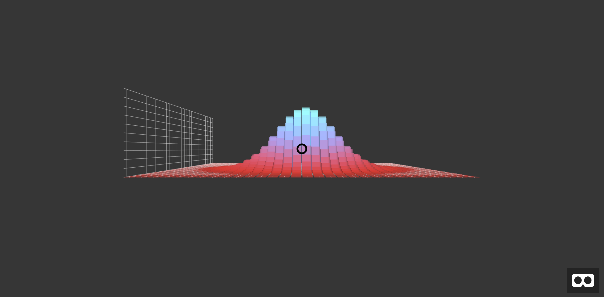

# VR-Viz Boilerplate [![Sponsored](https://img.shields.io/badge/chilicorn-sponsored-brightgreen.svg?logo=data%3Aimage%2Fpng%3Bbase64%2CiVBORw0KGgoAAAANSUhEUgAAAA4AAAAPCAMAAADjyg5GAAABqlBMVEUAAAAzmTM3pEn%2FSTGhVSY4ZD43STdOXk5lSGAyhz41iz8xkz2HUCWFFhTFFRUzZDvbIB00Zzoyfj9zlHY0ZzmMfY0ydT0zjj92l3qjeR3dNSkoZp4ykEAzjT8ylUBlgj0yiT0ymECkwKjWqAyjuqcghpUykD%2BUQCKoQyAHb%2BgylkAyl0EynkEzmkA0mUA3mj86oUg7oUo8n0k%2FS%2Bw%2Fo0xBnE5BpU9Br0ZKo1ZLmFZOjEhesGljuzllqW50tH14aS14qm17mX9%2Bx4GAgUCEx02JySqOvpSXvI%2BYvp2orqmpzeGrQh%2Bsr6yssa2ttK6v0bKxMBy01bm4zLu5yry7yb29x77BzMPCxsLEzMXFxsXGx8fI3PLJ08vKysrKy8rL2s3MzczOH8LR0dHW19bX19fZ2dna2trc3Nzd3d3d3t3f39%2FgtZTg4ODi4uLj4%2BPlGxLl5eXm5ubnRzPn5%2Bfo6Ojp6enqfmzq6urr6%2Bvt7e3t7u3uDwvugwbu7u7v6Obv8fDz8%2FP09PT2igP29vb4%2BPj6y376%2Bu%2F7%2Bfv9%2Ff39%2Fv3%2BkAH%2FAwf%2FtwD%2F9wCyh1KfAAAAKXRSTlMABQ4VGykqLjVCTVNgdXuHj5Kaq62vt77ExNPX2%2Bju8vX6%2Bvr7%2FP7%2B%2FiiUMfUAAADTSURBVAjXBcFRTsIwHAfgX%2FtvOyjdYDUsRkFjTIwkPvjiOTyX9%2FAIJt7BF570BopEdHOOstHS%2BX0s439RGwnfuB5gSFOZAgDqjQOBivtGkCc7j%2B2e8XNzefWSu%2BsZUD1QfoTq0y6mZsUSvIkRoGYnHu6Yc63pDCjiSNE2kYLdCUAWVmK4zsxzO%2BQQFxNs5b479NHXopkbWX9U3PAwWAVSY%2FpZf1udQ7rfUpQ1CzurDPpwo16Ff2cMWjuFHX9qCV0Y0Ok4Jvh63IABUNnktl%2B6sgP%2BARIxSrT%2FMhLlAAAAAElFTkSuQmCC)](http://spiceprogram.org/oss-sponsorship)

This git repo provides a boilerplate for creating data visualization in VR using __[VR-Viz](https://github.com/mustafasaifee42/VR-Viz)__  package. 

__VR-Viz is react component which combines React.js, D3.js and A-frame to create data visualization in VR.__

__Interactive examples can be seen and explored [here](https://vr-viz.netlify.com).__

__Git Repo for VR-Viz can be found [here](https://github.com/mustafasaifee42/VR-Viz).__ 

## Installation using Yarn
This project uses `yarn`. Install it as described here [https://yarnpkg.com/en/docs/install](https://yarnpkg.com/en/docs/install) if you haven't already.

To install this boilerplate, simply clone the repo and run `yarn`;

e.g.

    git clone https://github.com/mustafasaifee42/vr-viz-boilerplate.git
    cd vr-viz-boilerplate
    yarn

## Local Development

In the project directory, you can run:

### `yarn start`

Runs the app in the development mode. 
Open [http://localhost:3000](http://localhost:3000) to view it in the browser.

The page will reload if you make edits. 
You will also see any lint errors in the console.

To view this in your VR headset (if the headset is connected to the same system on which the local development is done) open a browser(prefereablly latest version of chrome, firefox or edge) in the VR environment and open [http://localhost:3000](http://localhost:3000) in it.

If the headset is connected to another system than on which the local development is done then using `ipconfig` in CLI get the IPv4 address of the system on which the development is done. Then, open a browser(prefereablly latest version of chrome, firefox or edge) in the VR environment in the headset and open `{ip-address}:3000` in it (replace ip-address with the IPv4 address got using `ipconfig`). Make sure that both the systems are connected to the same wi-fi network.

In the browser you should be able to see a barchart.

To enter the VR mode click the Enter VR Mode icon in the bottom right in the browser.

## Editing the Boilerplate

### Updating the data sheet

In the project directory, in public folder edit `data.csv` file with new data to plot that data in VR. You can replace this file in public folder with another `csv`, `json`, `txt`, or `ply` file which has your data.

* `csv` file can be created in excel or any other software.
* `txt` file is used for datafiles without headers with values seperated by a comma.
* `ply` is primarily used for `point cloud` visualization.

### Updating the graph

In the project directory, in src folder edit `App.js` file. Read the detail documention [here](https://github.com/mustafasaifee42/VR-Viz) how `App.js` can be edited to use a specific visualization and how these visualizations can be edited.

__Supported Visualizations__
* [3D Bar Graph](https://github.com/mustafasaifee42/VR-Viz/blob/master/ReadMe/BarGraph.md)
* [3D Stacked Bar Graph](https://github.com/mustafasaifee42/VR-Viz/blob/master/ReadMe/StackedBarGraph.md)
* [3D Lollipop Chart](https://github.com/mustafasaifee42/VR-Viz/blob/master/ReadMe/LollipopChart.md)
* [3D Rectangle Chart](https://github.com/mustafasaifee42/VR-Viz/blob/master/ReadMe/RectangleChart.md)
* [3D Scatter Plot / 3D Bubble Chat](https://github.com/mustafasaifee42/VR-Viz/blob/master/ReadMe/ScatterPlot.md)
* [3D Connected Scatter Plot](https://github.com/mustafasaifee42/VR-Viz/blob/master/ReadMe/ConnectedScatterPlot.md)
* [3D Mesh Plot](https://github.com/mustafasaifee42/VR-Viz/blob/master/ReadMe/MeshPlot.md)
* [Waterfall Plot](https://github.com/mustafasaifee42/VR-Viz/blob/master/ReadMe/WaterFallPlot.md)
* [3D Time Series](https://github.com/mustafasaifee42/VR-Viz/blob/master/ReadMe/TimeSeries.md)
* [3D Contour Plot](https://github.com/mustafasaifee42/VR-Viz/blob/master/ReadMe/ContourPlot.md)
* [3D Parametric Curve Plot](https://github.com/mustafasaifee42/VR-Viz/blob/master/ReadMe/ParametricCurvePlot.md)
* [3D Surface Plot](https://github.com/mustafasaifee42/VR-Viz/blob/master/ReadMe/SurfacePlot.md)
* [3D Parametric Surface Plot](https://github.com/mustafasaifee42/VR-Viz/blob/master/ReadMe/ParametricSurfacePlot.md)
* [3D Contour Map](https://github.com/mustafasaifee42/VR-Viz/blob/master/ReadMe/ContourMap.md)
* [3D Point Cloud](https://github.com/mustafasaifee42/VR-Viz/blob/master/ReadMe/PointCloud.md)
* [3D Force Directed Graph](https://github.com/mustafasaifee42/VR-Viz/blob/master/ReadMe/ForceDirectedGraph.md)
* [3D Prism Map](https://github.com/mustafasaifee42/VR-Viz/blob/master/ReadMe/PrismMap.md)
* [3D Map Bar Graph](https://github.com/mustafasaifee42/VR-Viz/blob/master/ReadMe/MapBarChart.md)
* [3D Map Stacked Bar Graph](https://github.com/mustafasaifee42/VR-Viz/blob/master/ReadMe/MapStackedBarChart.md)
* [MapTimeBars](https://github.com/mustafasaifee42/VR-Viz/blob/master/ReadMe/MapTimeBars.md)
* [MapWithIsoLines](https://github.com/mustafasaifee42/VR-Viz/blob/master/ReadMe/MapWithIsoLines.md)
* [3D Flow Map](https://github.com/mustafasaifee42/VR-Viz/blob/master/ReadMe/FlowMap.md)
* [3D TreeMap](https://github.com/mustafasaifee42/VR-Viz/blob/master/ReadMe/TreeMap.md)
* [3D Spiral Plot](https://github.com/mustafasaifee42/VR-Viz/blob/master/ReadMe/SpiralPlot.md)

## Building the React App

App need to build so the app can be uploaded on the server to build the app you can run:

### `yarn run build`

For building the app as a sub page in website, `homepage` parameter in __package.json__ needs to edited to the exact link otherwise the app expects to be run from the root directory of the webserver. For example `homepage: 'www.example.com/vr-app'` if the app need to uploaded at www.example.com/vr-app

## Note

This project was bootstrapped with [Create React App](https://github.com/facebookincubator/create-react-app).

To see the full documentation regarding that, go [here](https://github.com/facebookincubator/create-react-app/blob/master/packages/react-scripts/template/README.md). The salient points are reproduced below, along with important custom setup documentation.
